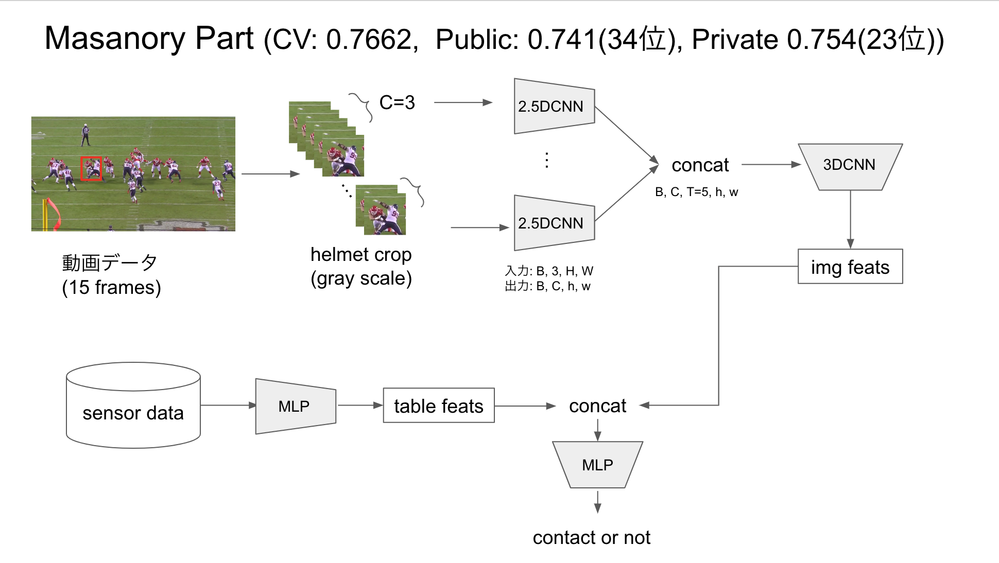

# [1st and Future - Player Contact Detection](https://www.kaggle.com/competitions/nfl-player-contact-detection)

24th / 939 teams 🥈


## Solution  
### Masanory Part
CV: 0.7662,  Public: 0.741(34th), Private 0.754(23rd)
  

- The solution was inspired by [DFL 1st's](https://www.kaggle.com/competitions/dfl-bundesliga-data-shootout/discussion/359932) idea.
- Input consists of 15 frames in grayscale.
- Cropped around the helmet for input.   
- Crop size is 6 times the size of the helmet.
- Stacked in the channel direction with T=3 and input to a CNN.
- Then, stacked 5 feature maps in the time direction and aggregated the temporal features with a 3D CNN.
  
augmentation 
``` 
train_aug = A.Compose([
    A.Resize(height=CFG['resize'],width=CFG['resize'], p=1),
    A.HorizontalFlip(p=0.5),
    A.ShiftScaleRotate(p=0.5),
    A.RandomBrightnessContrast(brightness_limit=(-0.1, 0.1), contrast_limit=(-0.1, 0.1), p=0.5),
    A.OneOf([
        A.MotionBlur(p=.2),
        A.MedianBlur(blur_limit=3, p=0.1),
        A.Blur(blur_limit=3, p=0.1),
    ], p=0.25),
    A.Cutout(num_holes=8, max_h_size=12, max_w_size=12, fill_value=0, p=0.5),
    A.Normalize(mean=[0.], std=[1.]),
    ToTensorV2()
])
```

### Final Solusion 
CV: 0.786,  Public: 0.762(21st), Private 0.751(23rd)

Final solution is as follows:
- First, compute the oof prediction using the 1st xgb model. The xgb features are arithmetic features related to the five players closest to the target player.  
- Extract players with xgb oof greater than 0.01. This reduces the data volume by 1/3.
- Created multiple CNN models such as p2g model, p2p model, p2p&p2p, and p2p RGB model.
- Use the CNN oof prediction as a feature and train a 2nd stage xgb model to obtain the final result.